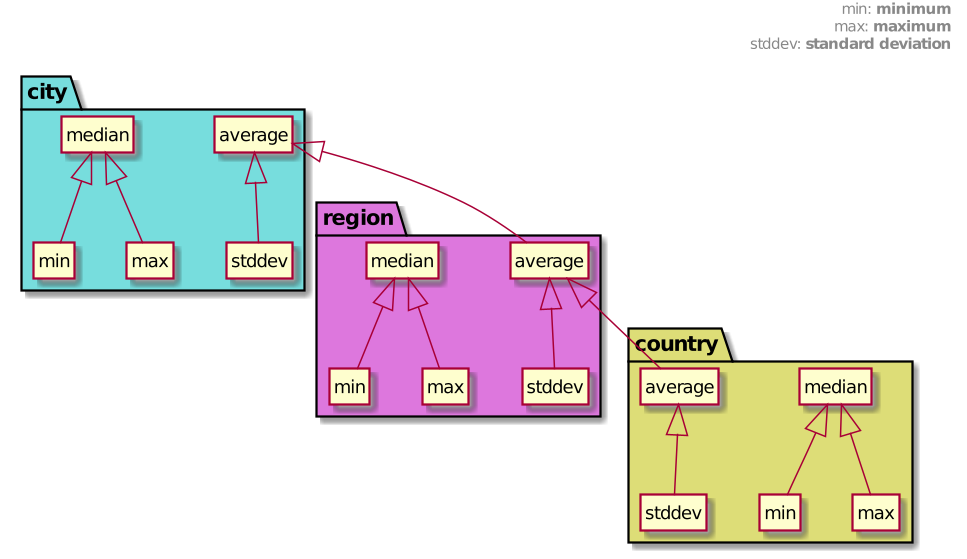

# Students Statistics

Objetivo: calcular métricas (estatísticas) nacionais, regionais e
municipais (3 níveis) a partir de notas (de 0 a 100) hipotéticas de
alunos do 9o ano do ensino fundamental.

As estatísticas são, **para cada nível**:

- Menor nota (***min***),
- Maior nota (***max***),
- Mediana (***med***),
- Média aritimética simples (***avg***) e,
- Desvio padrão (***std***).

***Serão premiadas a cidade e a região com as maiores médias aritiméticas simples.***

## Formato de entrada

Matricial:

- Cada elemento: nota de um aluno (geradas pseudo-aleatoriamente, com ***seed*** proveniente do último argumento de entrada por linha de comando)
- Cada linha: uma cidade
- Cada parte de matriz: uma região

As notas dos alunos (inteiros de 0 a 100) devem ser geradas na seguinte ordem:

1. crescente por aluno
1. crescente por cidade
1. crescente por região

## Formato de saída

Deve ser exibida a menor (***min***) e a maior nota (***max***), a mediana (***med***), a média (***avg***) e o desvio padrão (***std***) para cada cidade, cada região e, por fim, para o Brasil.

A numeração dos alunos, cidades e regiões serão iniciadas em zero, sendo que na saída, as estatísticas devem estar apresentadas pelos índices em ordem crescente.

Após, devem ser indicadas a região e a cidade que receberão os prêmios

## Compilando

### Paralelo

Para compilar o paralelo (`studentspar`), é necessário vincular com *math* (por causa do `sqrt()`) e compilar com OpenMP (por causa do `omp_get_wtime()`):

```
mpicc studentspar/studentspar -o studentspar -Wall -lm -fopenmp
``` 

### Sequencial

Para compilar o sequencial (`studentsseq`), é necessário vincular com *math* (por causa do `sqrt()`) e compilar com OpenMP (por causa do `omp_get_wtime()`):

```
gcc studentsseq/studentsseq -o studentsseq -Wall -lm -fopenmp
``` 

## Execução do programa

Para executar o programa paralelo `studentspar` (que está na pasta [studentspar](./studentspar)) :

```
mpirun -np <N> --hostfile <hostfilehostfilename> studentspar/studentspar <R> <C> <A> <SEED>
```

Onde:

- N é a quantidade de de execuções de `studentspar` que serão iniciadas
- hostfilename é o arquivo *hostfile* de mapeamento de carga de processamento
- R é a quantidade de regiões
- C é a quantidade de cidades por região
- A é a quantidade de alunos por cidade
- SEED é a semente utilizada na geração dos números aleatórios

Para executar o programa sequencial (que está na pasta [studentsseq](./studentsseq)) :

```
./studentsseq/studentsseq <R> <C> <A> <SEED>
```

Onde:

- R é a quantidade de regiões
- C é a quantidade de cidades por região
- A é a quantidade de alunos por cidade
- SEED é a semente utilizada na geração dos números aleatórios

## Desenvolvimento

Foi utilizado a metodologia **PCAM** para desenvolvimento (***particionamento***, ***comunicação***, ***aglomeração*** e ***mapeamento***), baseando-se em uma máquina MIMD de memória distribuida.

## Objetivo do desenvolvimento

Minimizar o tempo de resposta da aplicação, sendo que não será considerado o tempo de entrada de dados, alocação de memória, geração de números aleatórios nem impressão de resultados na tela. 

# Desenvolvimento dos estágios da metodologia PCAM

### Particionamento

**O particionamento será feito por funções.**

É necessário realizar o cálculo de 6 estatísticas para o país, 6\*R estatísticas para as regiões e 6\*R\*C estatísticas para as cidades. O cálculo de cada estatística será uma tarefa distinta, logo será um total de 6\*(1+R\*(1+C)) tarefas.

Ex: Para um país com 3 regiões, cada região com 5 cidadese e cada cidade com 11 alunos, serão: 6 tarefas para o país, 18 tarefas para as regiões e 90 tarefas para as cidades.

As tarefas das cidades, regiões e país precisam ter acesso de leitura (para cálculo das notas mínima, máxima, média e do desvio padrão) e escrita (para ordenação devido ao cálculo da nota mediana) aos dados. Tendo em vista que a ordenação das notas retira toda a complexidade de cálculo das notas mínima e máxima, aproveitar-se-á deste fato, assim calculando primeiramente a mediana, depois as notas mínima e máxima. Então é calculada a média e o desvio padrão, nesta ordem, já que este depende daquela.

Devido à necessidade de escrita (ordenação dos elementos), cada sêxtupla de tarefas para cálculo estatístico (***min***, ***max***, ***med***, ***avg*** e ***std***) deve ter uma cópia de seu respectivo elemento (cidade, região ou país) para executar os cálculos na ordem especificada a cima.


## Comunicação

Para a comunicação, é importante entender como se dão as dependências entre as tarefas. O Diagrama UML de classes abaixo ilustra (por meio de herença) a dependência entre as estatísticas a serem calculadas.

[comment]:
